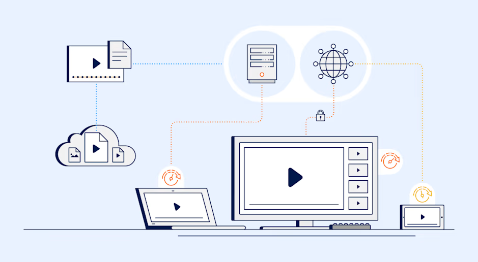
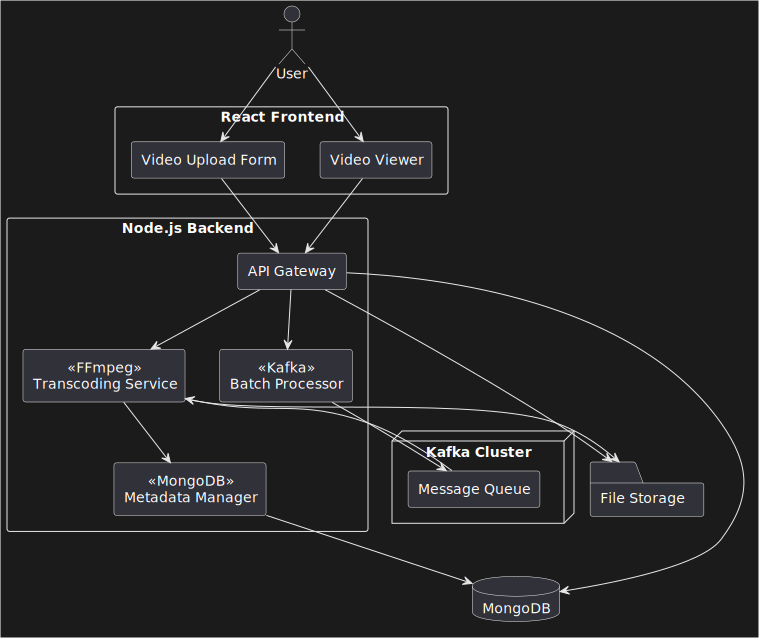
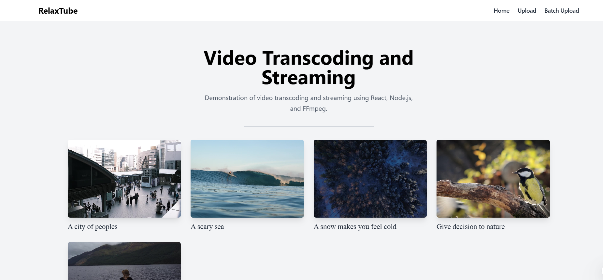
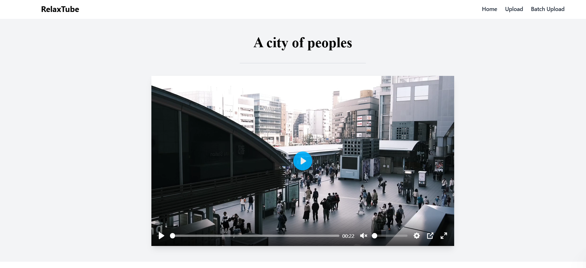
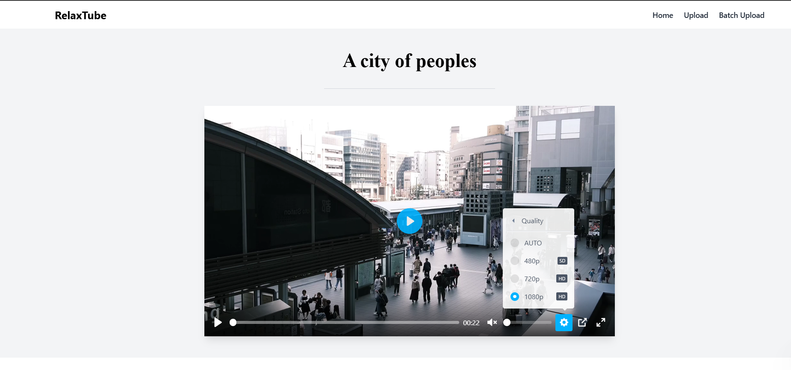
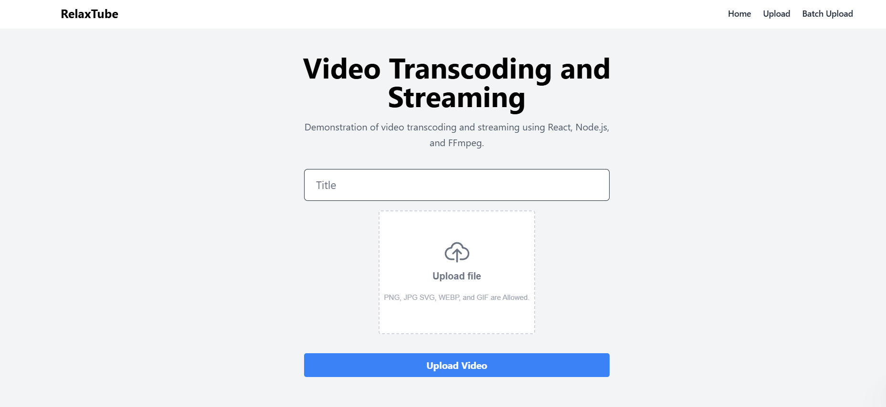
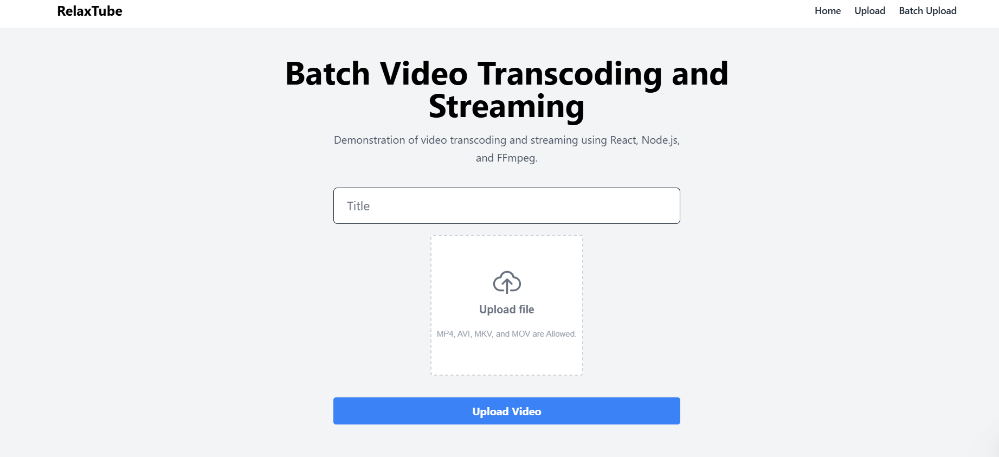

# RealxTube

RealxTube is a scalable and efficient application designed to demonstrate the workflow of video transcoding and streaming. Built using Node.js, React, Kafka, and FFmpeg, this project showcases key features like video transcoding to multiple qualities, segment generation for smoother streaming, and thumbnail creation. The data is stored in MongoDB, while video files and metadata are managed in a local file storage system.

<p float="left">
    
    
    
    
    
</p>

<p float="left">
    
    
    
    
    
    
    
    
    
</p>

## Architecture



## Features

- **Video Transcoding**: Convert videos into multiple quality levels (e.g., 360p, 480p, 720p, 1080p) using FFmpeg.
- **Video Segmentation**: Generate video segments in HLS format for efficient streaming and reduced loading times.
- **Thumbnail Generation**: Automatically create thumbnail images for each video.
- **Batch Processing**: Handle multiple video files simultaneously for improved processing efficiency.
- **Scalable Architecture**: Built to handle increased load and scale as required.
- **Data Storage**: Store metadata in MongoDB and manage files in local storage.

## Tech Stack

### Backend
- **Node.js (Express)**: Handles server-side logic, video processing, and API endpoints.
- **Kafka**: Manages message queues for batch processing and scalability.
- **FFmpeg**: Performs video transcoding, segmentation, and thumbnail generation.
- **MongoDB**: Stores video metadata, quality options, and other related data.

### Frontend
- **React**: Provides a user-friendly interface for uploading videos, viewing processed content, and managing workflows.

### Additional Tools
- **Docker**: Used to containerize and run the application locally.

## Installation

1. **Clone the Repository**
   ```bash
   git clone https://github.com/ravikisha/realxtube.git
   cd realxtube
   ```

2. **Set Up Environment Variables**
   run the docker-compose file
   ```bash
    docker-compose up -d
    ```

3. **Install Dependencies**
   ```bash
    cd frontend
    npm install

    cd ../backend
    npm install

    cd ../transcoding-service
    npm install
   ```

4. **Run Kafka**
   Make sure Kafka is running locally or accessible remotely.

5. **Start the Backend Server**
   ```bash
   cd backend
   npm run dev
   ```

6. **Start the Frontend**
   ```bash
    cd frontend
    npm run dev
   ```

7. **Start the Transcoding Service**
   ```bash
    cd transcoding-service
    npm run dev
    ```

7. **Access the Application**
   Open your browser and navigate to `http://localhost:3000`.

## Usage

1. Upload a video file through the web interface.
2. The backend processes the video by:
   - Transcoding it into multiple quality levels.
   - Generating video segments for streaming.
   - Creating a thumbnail image.
3. Processed files and metadata are stored in the local file system and MongoDB.
4. Use the frontend to view available videos, stream content, or download specific segments.

## Screenshots






## Scalability
- [x] **Batch Processing**: Process multiple videos concurrently with Kafka queues.
- [ ] **Distributed Architecture**: Add more workers or scale the application horizontally to handle larger workloads.
- [ ] **Cloud Deployment**: Deploy the application on cloud platforms like AWS, Azure, or Google Cloud for improved scalability.
- [ ] **Load Balancing**: Use load balancers to distribute incoming requests across multiple servers.
- [ ] **Caching**: Implement caching mechanisms to reduce processing time and improve performance.
- [ ] **Monitoring**: Use monitoring tools like Prometheus, Grafana, or ELK stack to track performance metrics and identify bottlenecks.

## Future Enhancements
- Integrate cloud storage solutions (e.g., AWS S3, Google Cloud Storage).
- Implement user authentication and access control.
- Add support for advanced analytics and monitoring.

## License

This project is licensed under the MIT License. See the LICENSE file for details.

---

Feel free to contribute to the project by submitting pull requests or reporting issues!
